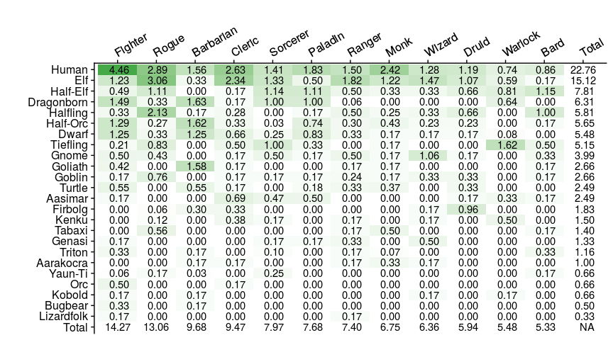
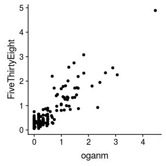
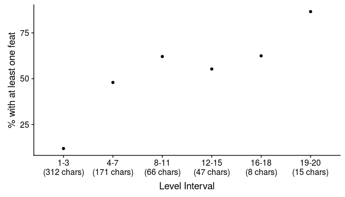
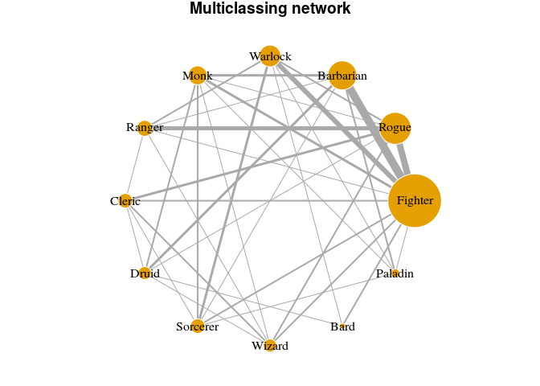
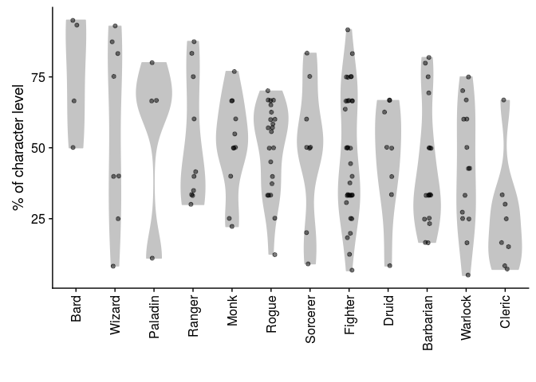
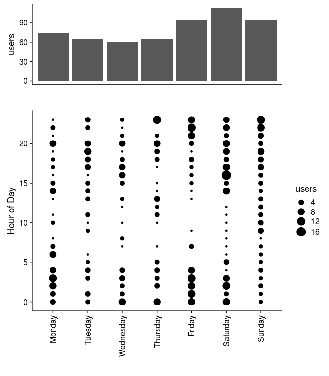

DnD character statistics
========================

Introduction
------------

About a year ago FiveThirtyEight published a short article called ["Is Your D&D Character Rare?"](https://fivethirtyeight.com/features/is-your-dd-character-rare/). It was a product of a deal between Curse and FiveThirtyEight which meant the data was not available to anyone else. I was a little jealous that I couldn't play with the data and disappointed that they only counted class race combinations and called it a day.

Shortly after that I released a few add ons ([1](https://oganm.github.io/printSheetApp/),[2](https://oganm.github.io/5eInteractiveSheet/)) for a [popular mobile application](https://play.google.com/store/apps/details?id=com.wgkammerer.testgui.basiccharactersheet.app&hl=en_CA) which allowed me to collect the users' character sheets.

After 3.5 months of data collection I have a whopping... 619 unique characters in my database that I can play with. Well... I'm not as popular as DnDBeyond but I don't see anyone else waving around thousands of character sheets for us to data mine so it'll have to do.

Is Your D&D Character Rare II?
------------------------------

To start with let's repeat the original analysis from FiveThirtyEight. I am not going to pretend like I have many thousands of samples so instead of per 100,000 this shows class and race combinations per 100 characters. You'll also notice that there are decimal points. In FiveThirtyEight's table, characters with multiple classes count once for each class. Here I divided multiclassed characters based on the proportion of their class levels. For instance a character who is a Fighter 5/Rogue 15 will add 0.75 to the rogue count and 0.25 to the fighter count. It also includes all races. Homebrew and UA classes are removed.

Despite the methodoligal differences, these results seem to match with FiveThirtyEight data. Graph below shows the % occurence of a class/race combination in FiveThityEight data and my data.

Is your character archetype rare?
---------------------------------

Is your feat choice rare?
-------------------------

Jeremy Crawford once [tweeted](https://twitter.com/jeremyecrawford/status/969020122177331200?lang=en)

> Another piece of D&D data: a majority of D&D characters don't use feats. Many players love the customization possible with feats, but a larger group of players is happy to make characters without feats. Feats are, therefore, not a driving force behind many players' choices.

We can see weather or not our data agrees. On a surface look 33% of all characters have at least one feat. However this is partially caused by the fact that a significant portion (27%) of our characters are level 1. We can see that by higher levels, feat adoption rates increase significantly, suggesting that once given the opportunity, players are likely to pick a feat.

It can be postulated players spend most of their time between levels 4-15. 52% of all characters in this range has at least one feat.

Is your multiclass combination rare?
------------------------------------

Since our dataset includes multiclassed characters, we can see which classed tend to appear together. Note that our sample size much smaller here (71 characters). Node sizes in the network below show how many times a class appeared in all multiclassed characters. The thickness of the lines between the nodes are determined by the number of characters both classes appear in. For instance we see that most rangers multiclass with rogues, while most rogues multiclass with fighters.

While this network is good to show which classes tend to be chosen together, it doesn't give much information about how classes are distributed. In the below graph we look at what is ratio of class levels in individual characters. A Fighter 5/Rogue 15 would appear as a 25% data point in the Fighter column and 75% in the Rogue column.

While there is a high amount of variation in the data, some conventional wisdom pops up through the means. Warlock is famous for its dipping potential and a Cleric level synergizes nicely with many other class features. I am a proud owner of a Cleric dipped Fighter myself. I would avoid reading too much into this though. The variance is too high and sample size is too low to make reliable inferences.

Both multiclassing and picking feats are somewhat advanced character building rules. While making the character building process complicated, they can be used to create frighteningly affective combinations (or get stuck waiting till the end of the campaign till their build gets everyting they want). Intuitively, it wouldn't be surprising to see that multiclassers are more likely to get feats to optimize their builds. Indeed, we see that 59% of multiclassed characters above level 3 chose to get a feat as opposed to 53% of single classed counterparts. A modest yet statistically significant difference.

Is your game day rare?
----------------------

My applications are they are purely utilitarian. One gives you a character sheet, the other is an interactive character sheet that automates your dice roll. It is reasonable to think that most people would be using them before or during a game. It

About the data
--------------

Unique characters are aquired by grouping the characters that share the same name and class and picking the higher level version. If a multiclassed character shares name with a single classed character, I assume they are duplicates if the single classed character is lower level and its class matches with one of the classes of the multiclassed character. Any character above level 20 (there were 3) was removed. 8 Revised Rangers were merged back into the ranger class. Most percentages are rounded to the nearest integer

As all data, this data comes with caveats. It is a subset of all DnD players who are using a particular mobile application who also know about and use my applications and consented to let me to keep their character sheets. I don't have reason to think that these would be enriching certain character building choices but it's something to keep in mind.

I do believe however it is likely to have less test characters than DnDBeyond because my tools require a pre-existing character created in a different tool. Even if a user wants to just test it out they are likely to have a pre-existing character. This is of course my humble opinion (in fact 2 characters in my corpus are named "Test").
